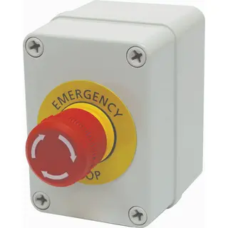
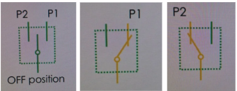
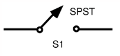
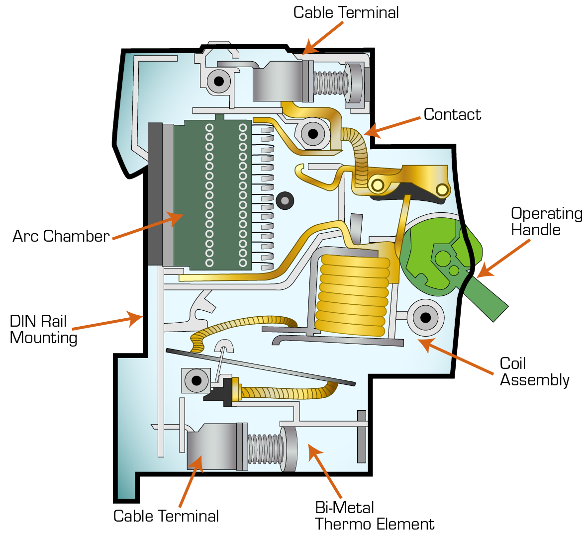
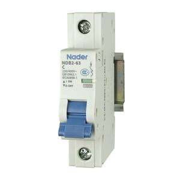

# ⚙️ Chapter 1: Basic Automation Tools

This chapter introduces the most common manual control devices used in automation systems — **toggle switches**, **push buttons**, **emergency (kill) switches** and many more. Understanding how these work is essential for designing and troubleshooting control circuits.

---

### Automation Switches

#### 1. Toggle Switch
A **toggle switch** maintains its last state even after being released. It’s not commonly used in automation because it doesn’t automatically reset, but is typical in manual applications such as light controls.

**Key Characteristics**
- Stays in its final position after being toggled  
- Requires manual action to return to the original state  
- Example: regular light switch  

| Diagram | Example |
| :------: | -------: |
|  | |

---
### 2. Push Button Switch

A push button returns to its **original state** after being released. It’s **commonly used in automation** to provide momentary input signals.

There are two main types of push buttons:

##### 2.1 Normally Open (NO) Push Button – *Start Switch*

**Behavior:**
- Default state: **OFF**
- When pressed: **ON**
- When released: returns to **OFF**

**Usage:** Used to **start a circuit** or process.

##### 2.2 Normally Closed (NC) Push Button – *Stop Switch*

**Behavior:**
- Default state: **ON**
- When pressed: **OFF**
- When released: returns to **ON**

**Usage:** Used to **stop a circuit** or process.

**Summary**
| Switch | Diagram | Example |
| :------- | :------: | -------: |
| NO (Start Button) | | |
| NC (Stop Button) | | |
---

### 3. Emergency (Kill) Switch

An emergency stop (E-Stop) is a **safety mechanism** designed to quickly shut off power or stop a machine in case of danger. It is usually large, red, and latching which means it stays off until manually reset.

**Key Characteristics**
- Immediately cuts power to the system  
- Must be manually reset to resume operation  
- Enhances operator safety  
- Commonly labeled as **E-STOP** or **Emergency Stop**

| Diagram | Example |
| :------: | -------: |
|  |  |  

---

### 4. Selector Switch

A selector switch can be set to one of several fixed positions to select a control path in a circuit. Unlike push buttons, it **remains in its last position** until changed manually.

**Key Characteristics**
- Used for choosing control or operating modes (e.g., manual/auto)  
- Stays in the selected position  
- Often found on control panels and operator interfaces  

#### Types
| Type | Positions | Description | Diagram | Example |
|------|-------|---------|------------|-------------|
| **Two-position** | ON / OFF | Simple on-off control || |
| **Three-position** | OFF / P1 / P2 | Common in motor direction control |  |  |
| **Four-position** | OFF / P1 / P2 / P3| Used for motor speed selection | | |
| **Seven-position** | Multiple voltage ranges | Used for multimeter or selector applications |  |  |

---

### 5. Switch Categories (General)

Switches are categorized by the number of **poles** (input lines) and **throws** (output paths).

| Type | Meaning | Description | Diagram |
|------|----------|-------------|----------|
| **SPST** | Single Pole Single Throw | One input, one output |  |
| **SPDT** | Single Pole Double Throw | One input, two outputs |  |
| **DPST** | Double Pole Single Throw | Two inputs, one output |  |
| **DPDT** | Double Pole Double Throw | Two inputs, two outputs |  |

#### Summary

| Device Type | Default State | Action When Pressed | Common Use |
|--------------|----------------|----------------------|-------------|
| Toggle Switch | Holds last position | Changes state manually | Manual control (e.g., lights) |
| NO Push Button | OFF | Turns ON when pressed, returns to OFF | Start circuit |
| NC Push Button | ON | Turns OFF when pressed, returns to ON | Stop circuit |
| Selector Switch | Holds last position | Rotates to select one of several paths | Mode selection (Auto/Manual/Speed) |

### Relays
A relay is an **electromechanical switch** that uses a magnetic coil to control a circuit. When voltage is applied to the coil, it becomes an electromagnet that changes the state of the contacts (NO/NC).

**Key Components:**
- **Coil (2 terminals):** Energized by control voltage  
- **Normally Open (NO) Contact:** Closes when coil is energized  
- **Normally Closed (NC) Contact:** Opens when coil is energized  
- **Common (COM):** Shared connection between NO and NC  

**Diagram:**  

#### Relay Types

| Basis | Example | Description |
|--------|----------|-------------|
| **Operating Voltage** | 5V, 12V, 24V, 48V, 120V, 230V (DC/AC) | Voltage applied to energize the coil |
| **Number of Pins** | 5-pin, 8-pin, 11-pin, 14-pin | Defines number of NO, NC, and COM contacts |
| **Max Current** | 20A | Maximum current that contacts can handle |

---
### Contactors
A contactor is a heavy-duty **electromechanical switch** used to control **high-current devices** such as motors, heaters, and lighting systems.

**Why Use a Contactor?**
> Push buttons and relays handle control logic — but **contactors handle power.**

**Components:**
- **Coil:** Energized to close the main contacts  
- **Main Contacts:** 3 NO (normally open) contacts for power connection  
- **Auxiliary Contacts:** 1 NO + 1 NC used in control circuits  
  - Can be extended with additional modules if needed  

**Diagram:**  

#### Contractor Types
| Type | Example |
|-------|----------|
| **Operating Voltage:** | 120–250V AC/DC |
| **Main Contact Current:** | 10A – 2600A |

---

###  Relay vs Contactor

| Feature | Relay | Contactor |
|----------|--------|------------|
| **Purpose** | Control low-current signals | Control high-current loads, operating power circuits  |
| **Size** | Small, compact | Larger, heavy-duty |
| **Contacts** | 1–4 | 3+ main contacts |
| **Current Rating** | very low (up to 20A) | very high (10A–2600A) |
| **Application** | Control circuits | Power circuits (motors, lights, etc.) |
| **Diagram** |  | |

---

| Relay | OFF (coil not energized) | Energizes coil to connect NO/NC contacts | Control logic / low-current switching |
| Contactor | ON | Turns OFF & locks until reset | Safety / Emergency stop |
| Emergency Switch | ON | Turns OFF & locks until reset | Safety / Emergency stop |

