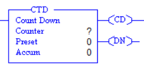
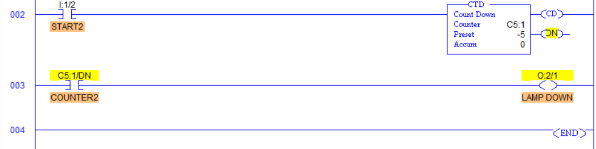
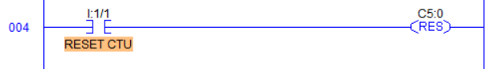
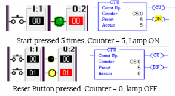
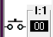
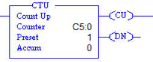
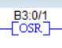
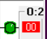
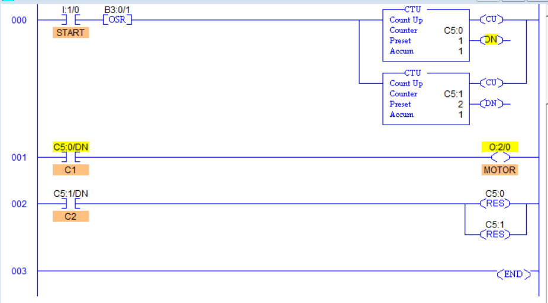
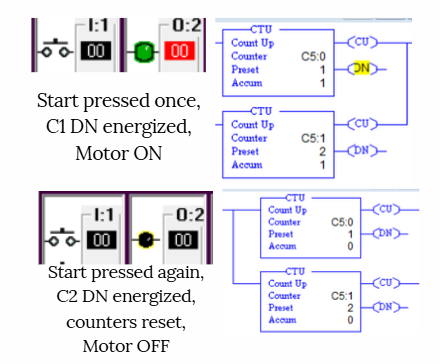

# Chapter 12: Allen-Bradley PLC counters

This chapter covers **Counter UP (CTU)** and **Counter DOWN (CTD)** instructions in the **LogixPro PLC simulator**, following along with the video tutorial.

### [🎥 Watch here](https://www.youtube.com/watch?v=tm_RRTyKxjU)

Counters are internal PLC instructions used to **count input pulses or events**.  
They are commonly used to trigger specific actions after a set number of occurrences.  
For example, stopping a conveyor after a certain number of boxes or activating an alarm after several failed attempts.

Each counter has:
- A **Preset Value (PRE)** – the target number of counts  
- An **Accumulated Value (ACC)** – the current number of counts  

Once the **ACC** equals or exceeds the **PRE**, an output or logical condition (Done bit) is triggered.  
Counters can also be **reset manually** using a reset coil.

##  PLC Counters in LogixPro

### CTU (Counter UP)

The **CTU (Count Up)** instruction increments its count each time the input transitions from **LOW → HIGH** (0 → 1).

### Counter Components in LogixPro

Here’s what the **CTU** counter block looks like in the LogixPro simulator:

### Parameters

#### **Inputs**
- **Counter:** The memory address assigned to the counter, usually between **C5:0 – C5:99**.  
  *Example:* `C5:0`
- **Preset Value (PRE):** The target count value at which the **Done (DN)** bit is activated.  
  *Example:* `5`
- **Accumulated Value (ACC):** Displays the current count value.  
  *Example:* Starts at `0` and increments → `1, 2, 3…` for each valid input pulse.

#### **Outputs**
- **EN (Enable Bit):** Turns ON whenever the counter rung input is TRUE (logic HIGH).  
- **DN (Done Bit):** Turns ON when the **Accumulated Value (ACC)** equals or exceeds the **Preset Value (PRE)** , indicating that the counter has reached its target.

---

### Mini Example – Turn ON Lamp Project

**Goal:** Turn ON a lamp after pressing the start button **5 times**.

| Ladder Code | I/O Simulator | Description |
|--------------|---------------|--------------|
| |  | Each time the **Start Button** is pressed, the **CTU counter (C5:0)** increments its count. Once the **Accumulated Value (ACC)** reaches the **Preset Value (PRE)** of 5, the **Done (DN)** bit activates and energizes the **Lamp**. Resetting the counter returns **ACC** to 0. |

> 🧠 **Key Concept:**  
> The **CTU (Count Up)** instruction is ideal for event-based control systems — such as counting parts on a conveyor, tracking machine cycles, or recording repetitive tasks.

---

### CTD (Counter DOWN)

The **CTD (Count Down)** instruction decrements its count each time the input transitions from **LOW → HIGH** (0 → 1).  
It is often used for countdown applications — such as batch unloading, reverse counts, or machine shutdown after a fixed number of operations.

### Counter Components in LogixPro

Here’s what the **CTD** counter block looks like in the LogixPro simulator:

### Parameters

#### **Inputs**

- **Counter:** The address assigned to the counter, typically between **C5:0 – C5:99**.  
  *Example:* `C5:1`
- **Preset Value (PRE):** The initial (starting) value from which the counter begins counting down.  
  *Example:* `5`
- **Accumulated Value (ACC):** Displays the current countdown progress.  
  *Example:* Starts at `0` and decrements → `-1, -2, -3, ...` for each valid pulse.

#### **Outputs**
- **EN (Enable Bit):** Turns ON whenever the rung input is TRUE (logic HIGH).  
- **DN (Done Bit):** Turns OFF once the **Accumulated Value (ACC)** reaches **PRE**, indicating the countdown is complete.

---

### Mini Example – Lamp OFF Project

**Goal:** Turn OFF a lamp after pressing the start button **5 times**.

| Ladder Code | I/O Simulator | Description |
|--------------|---------------|--------------|
|  |  | Each time the **Start Button** is pressed, the **CTD counter (C5:1)** decrements its value. When the **Accumulated Value (ACC)** reaches `-5`, the **Done (DN)** bit turns OFF, de-energizing the **Lamp**. The counter can be reset to reload the preset value for a new cycle. |

---

### RESET (RES)

The **RESET (RES)** instruction is used to **reset a counter** (either CTU or CTD) to zero once it receives a valid input pulse.  
It clears the **Accumulated Value (ACC)** without changing the **Preset Value (PRE)**.

### Counter Components in LogixPro

Here’s what the **RES** coil looks like in the LogixPro simulator:

### Parameters

#### **Inputs**

- **Address:** The address of the counter to be reset. 
  *Example:* `C5:1`

#### **Outputs**
- Resets the counter’s **Accumulated Value (ACC)** back to `0`.  
- The **Done (DN)** and **Enable (EN)** bits are also de-energized.

### Mini Example 1 – Manual Reset Button

**Goal:** Reset the counter manually after pressing the reset button.

| Ladder Code | I/O Simulator | Description |
|--------------|---------------|--------------|
| | | Each time the **Reset Button** is pressed, the **RES coil** resets the **CTU counter (C5:0)**, setting the **Accumulated Value (ACC)** to `0`. The counter is ready to start counting again. |

### Mini Example 2 – Auto Reset on Completion

**Goal:** Automatically reset the counter after it reaches its preset value.

| Ladder Code | I/O Simulator | Description |
|--------------|---------------|--------------|
|  |  | When the **CTD counter (C5:1)** reaches its preset value, the **RES coil** automatically resets the **ACC** to `0`. Due to scan time differences between the hardware and software cycles, a very short input pulse can sometimes be detected twice — causing the counter to reset and immediately increment to `1`. This issue is solved using an **OSR (One-Shot Rising)** instruction. |

---

### One-Shot Rising (OSR)

The **One-Shot Rising (OSR)** instruction ensures that a signal is recognized **only once** per activation.  
It detects the **rising edge** of a signal (when it transitions from 0 → 1) and sends a **single, one-scan pulse** to the next instruction — even if the input stays ON.

This prevents false double-counts caused by long input signals or hardware scan delays.

---

### Component in LogixPro

Here’s what the **OSR** instruction looks like in the LogixPro simulator:

### Parameters

#### **Inputs**
- **Marker:** A unique internal bit used by the OSR to store its state.  
  *Example:* `B3:0/1`

#### **Outputs**
- Produces a **single pulse** output for one program scan when the input transitions from **OFF → ON**.

### Mini Example 1 – Reliable Auto Reset

**Goal:** Ensure the counter resets correctly without producing unwanted increments.

| Ladder Code | I/O Simulator | Description |
|--------------|---------------|--------------|
| |  | The **OSR** ensures that the **CTD counter (C5:1)** resets only once when the done condition is met. Because OSR only responds to the **rising edge** (and ignores the continuous HIGH state), it eliminates false resets and guarantees accurate counting. |

---

> 🧠 **Key Concept:**  
> The **RES** instruction clears a counter instantly, while the **OSR** ensures reliable pulse detection.  
> Using them together improves accuracy in **high-speed counting**, **reset-based logic**, and **edge-triggered control** systems.

---

## Counters for Motor Start and Stop 

In this section, we use **two counters** instead of separate Start and Stop buttons to control the **motor operation**.  
One counter starts the motor, and the other counter resets both counters, effectively stopping the motor.

### PLC code Parameters

| I/O Simulator | Description |
|----------------|-------------|
| | **Start Switch:** A *Normally Open (NO)* push button used to start or stop the motor through counter logic. |
|  | **Counter C1 (CTU):** Counts button presses to **start** the motor when its Done bit (DN) turns ON. |
|  | **Counter C2 (CTU):** Counts button presses to **reset** both counters, effectively **stopping** the motor. |
|  | **Reset coil (RES):** Resets both the counters|
|  | **One Shot Rising (OSR):** ensures that the input pulse is only recognized once. |
|  | **Indicator Lamp:** Displays the ON state of the motor. |

### Program Logic

This logic demonstrates how two counters can be used to alternately **start** and **stop** a motor using a single push button.

| Ladder Code | I/O Simulator | Description |
|--------------|---------------|--------------|
| |  | When the **Start (NO)** button is pressed, both **Counter C1** and **Counter C2** increment by one. Once **Counter C1** reaches its **Preset Value (PRE) = 1**, its **Done Bit (DN)** energizes, turning the **Motor ON**. Pressing the **Start** button again increases the accumulated values for both counters. When **Counter C2’s DN** turns ON, it triggers the **RES coil** to reset both counters, de-energizing the motor (turning it OFF). An **OSR (One-Shot Rising)** instruction is used to ensure that each button press is registered only once, preventing false multiple counts due to signal bounce. |
