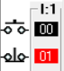

# Chapter 10: Industrial Fans One way Sequence with timers

This chapter covers **Industrial Fans One-Way Sequence PLC ladder logic** using **timers** in the **LogixPro simulator**, following along with the video tutorial.

### [🎥 Watch here](https://youtu.be/9iUPSFRZVeo)

In this exercise, you’ll design a control system for **three industrial fans** that operate in a **sequential order** with **timed delays**.  
The sequence is controlled by **one Start** and **one Stop** push button.  
The program ensures that each fan starts after a fixed delay, preventing simultaneous operation and allowing controlled sequencing.

---

### Concept Overview

This setup uses **two timers** to delay the activation of subsequent fans.  
When the system starts:

> Fan 1 starts immediately → Fan 2 starts **5 seconds later** → Fan 3 starts **5 seconds after Fan 2**

The **Stop** button immediately halts all fans and resets both timers.

### Visual Representation

-1.png>)

This diagram illustrates the **sequential operation**:
> **Fan 1 → (5s delay) → Fan 2 → (5s delay) → Fan 3**

---

## Parameters 

| I/O Simulator | Description |
|----------------|-------------|
|  | **Start/Stop Switches** — One *Normally Open (NO)* Start button and one *Normally Closed (NC)* Stop button for controlling all fans. |
|  | **Timer T1** — Controls delay between Fan 1 and Fan 2. |
|  | **Timer T2** — Controls delay between Fan 2 and Fan 3. |
|  | **Indicator Lamps** — Represent the ON state of Fan 1, Fan 2, and Fan 3 respectively. |

## Fan Operation Sequence with Timers

This logic demonstrates how the fans operate sequentially using **TON (Timer ON Delay)** instructions.

| Ladder Code | I/O Simulator | Description |
|--------------|---------------|--------------|
|  |  | When the **Start (NO)** button is pressed, **Fan 1** energizes immediately. Simultaneously, **Timer T1** starts counting. Pressing the **Stop (NC)** button de-energizes Fan 1 and resets Timer T1. |
|  |  | Once **Timer T1** completes its preset delay (5 seconds), its **Done (DN)** bit turns ON, energizing **Fan 2** and starting **Timer T2**. The Stop button de-energizes both Fan 1 and Fan 2, resetting the timers. |
|  |  | After **Timer T2** completes its delay (5 seconds), its **Done (DN)** bit energizes **Fan 3**. Pressing the Stop button de-energizes all fans and resets both timers, returning the system to idle. |

---

> 💡 **Tip:**  
>  One-way sequencing logic is often used in **industrial ventilation**, **cooling towers**, or **multi-stage motor control systems**.  
> It ensures balanced power usage and prevents reverse airflow or system overloads.

