# Chapter 11: Industrial Fans Closed Loop Control

This chapter covers **Industrial Fans Closed-Loop (Alternating) Control** using **timers** in the **LogixPro simulator**, following along with the video tutorial.

### [🎥 Watch here](https://www.youtube.com/watch?v=JlpN1qZh7Eg)

In this exercise, you’ll design a control system for **three industrial fans** that operate in an **alternating sequence** using timers.  
The process is controlled by a single **Start** and **Stop** push button.  
The logic ensures that each fan operates **one at a time**, alternating in a repeating timed cycle — preventing simultaneous operation and ensuring balanced load distribution.

---

### Concept Overview

This setup uses **three TON (Timer ON Delay)** timers to manage the switching sequence between the fans.  
When the system starts:

> **Fan 1** starts immediately 
> after **5 seconds**, **Fan 2** starts and **Fan 1 stops**  
> after **5 seconds**, **Fan 3** starts and **Fan 2 stops**  
> after another **5 seconds**, **Fan 1** starts again and **Fan 3 stops** — creating a **closed-loop rotation**.

The **Stop** button instantly halts whichever fan is active and resets all timers.

---

### Visual Representation

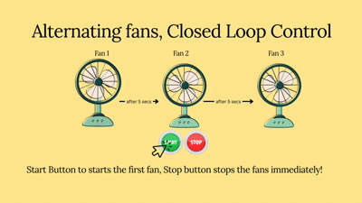

This video  illustrates the **closed-loop alternating sequence** of operation:
> **Fan 1 → (5s delay) → Fan 2 → (5s delay) → Fan 3 → (5s delay) → Fan 1** *(loop continues)*

---

## Parameters 

| I/O Simulator | Description |
|----------------|-------------|
| 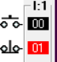 | **Start/Stop Switches** — One *Normally Open (NO)* Start button and one *Normally Closed (NC)* Stop button for controlling all fans. |
| 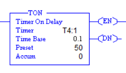 | **Timer T1** — Controls delay between Fan 1 and Fan 2. |
| 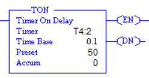| **Timer T2** — Controls delay between Fan 2 and Fan 3. |
| 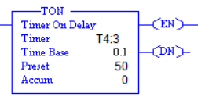 | **Timer T3** — Controls delay between Fan 3 and Fan 1. |
| 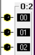 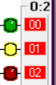| **Indicator Lamps** — Represent the ON state of Fan 1, Fan 2, and Fan 3 respectively. |

---

## Fan Operation Sequence with Timers

This logic demonstrates how the three fans operate alternately using **TON** timers, ensuring that only one fan is energized at any given time.

| Ladder Code | I/O Simulator | Description |
|--------------|---------------|--------------|
| 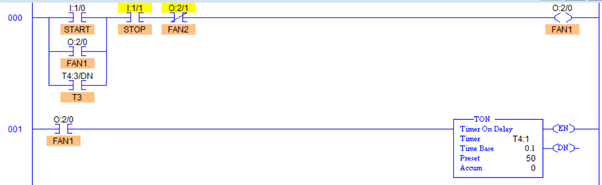 | 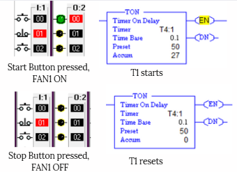| When the **Start (NO)** button is pressed, **Fan 1** energizes immediately, and **Timer T1** begins counting. The **Stop (NC)** button de-energizes **Fan 1** and resets **T1**. |
| 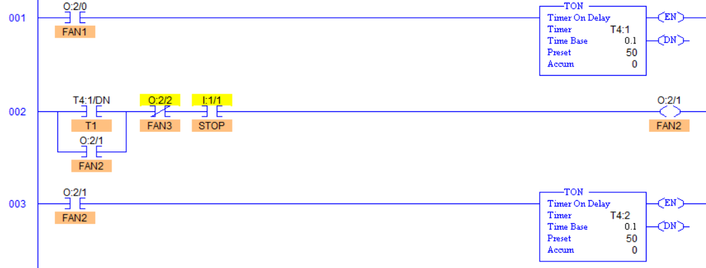 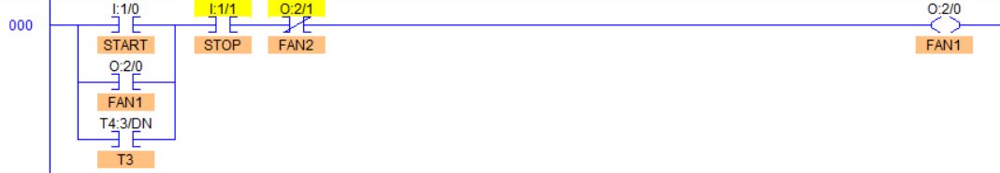| 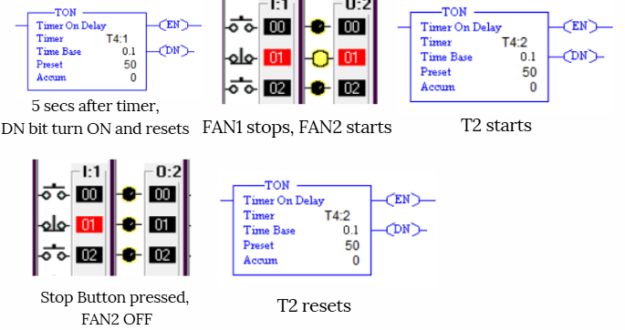 | Once **Timer T1** completes its preset delay (5 seconds), its **Done (DN)** bit turns ON, energizing **Fan 2** and starting **Timer T2**. Meanwhile, **Fan 1** de-energizes due to the inverse rung logic. The **Stop (NC)** button de-energizes **Fan 2** and resets **T2**. |
| 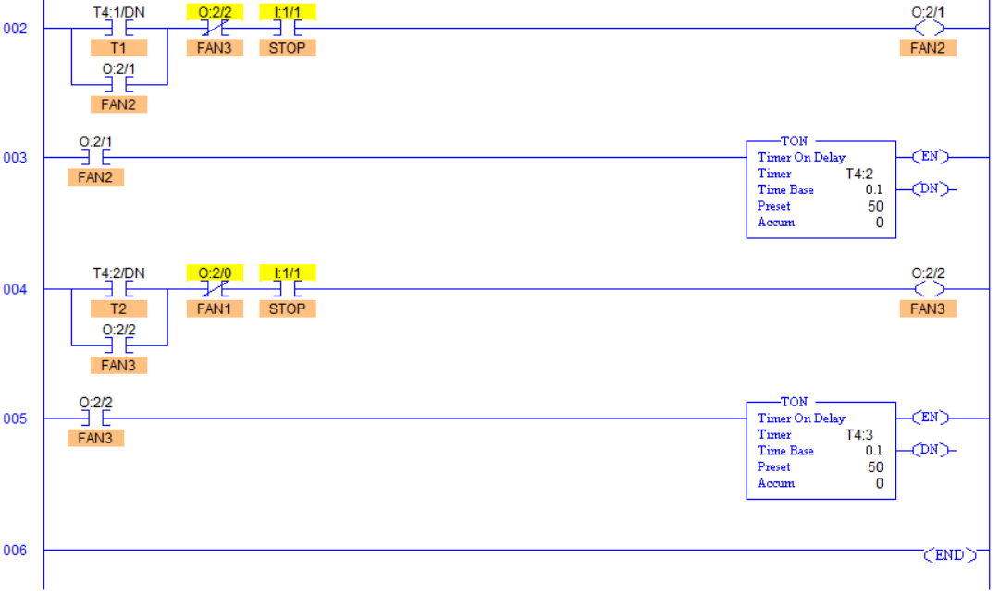 | 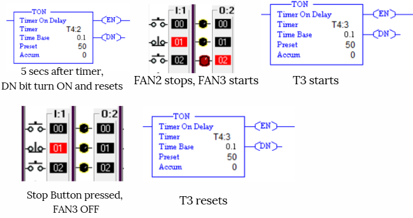 | When **Timer T2** completes its delay (5 seconds), its **Done (DN)** bit energizes **Fan 3**, and **Fan 2** de-energizes simultaneously. Pressing the **Stop** button halts the process and resets the timers. |
| 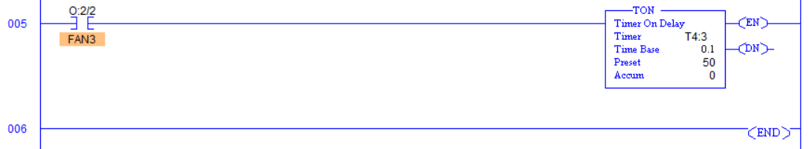| 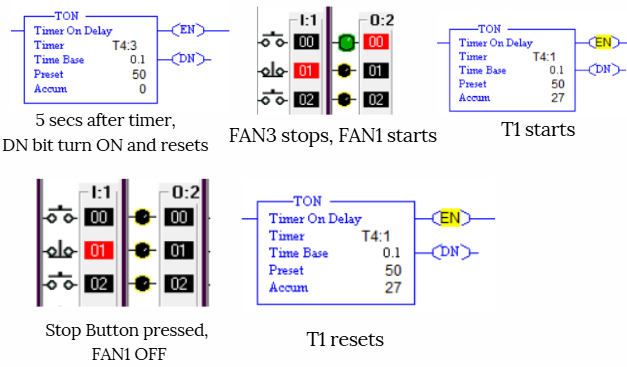| After **Timer T3** completes its delay (5 seconds), its **Done (DN)** bit re-energizes **Fan 1**, and **Fan 3** turns OFF, hence, completing the cycle. The process repeats continuously until the **Stop** button is pressed. |

---

> 💡 **Tip:**  
> Closed-loop or alternating fan control is widely used in **industrial ventilation**, **HVAC systems**, and **motor load sharing** applications.  
> It ensures **even equipment wear**, **balanced power consumption**, and **redundant operation** for continuous processes.
