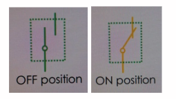

# Chapter 1: Basic Automation Tools

This chapter introduces the most common manual control devices used in automation systems — **toggle switches**, **push buttons**, **emergency (kill) switches** and many more. Understanding how these work is essential for designing and troubleshooting control circuits. It also explains the **protection devices** used in automation and electrical systems, mainly **overcurrent relays** and **circuit breakers (CBs)**. These components are critical for ensuring equipment safety, preventing damage, and isolating faulty circuits.

---

### Automation Switches

#### 1. Toggle Switch
A **toggle switch** maintains its last state even after being released. It’s not commonly used in automation because it doesn’t automatically reset, but is typical in manual applications such as light controls.

**Key Characteristics**
- Stays in its final position after being toggled  
- Requires manual action to return to the original state  
- Example: regular light switch  

| Diagram | Example |
| :------: | -------: |
|  | |

---
### 2. Push Button Switch

A push button returns to its **original state** after being released. It’s **commonly used in automation** to provide momentary input signals.

There are two main types of push buttons:

##### 2.1 Normally Open (NO) Push Button – *Start Switch*

**Behavior:**
- Default state: **OFF**
- When pressed: **ON**
- When released: returns to **OFF**

**Usage:** Used to **start a circuit** or process.

##### 2.2 Normally Closed (NC) Push Button – *Stop Switch*

**Behavior:**
- Default state: **ON**
- When pressed: **OFF**
- When released: returns to **ON**

**Usage:** Used to **stop a circuit** or process.

**Summary**
| Switch | Diagram | Example |
| :------- | :------: | -------: |
| NO (Start Button) | | |
| NC (Stop Button) | | |
---

### 3. Emergency (Kill) Switch

An emergency stop (E-Stop) is a **safety mechanism** designed to quickly shut off power or stop a machine in case of danger. It is usually large, red, and latching which means it stays off until manually reset.

**Key Characteristics**
- Immediately cuts power to the system  
- Must be manually reset to resume operation  
- Enhances operator safety  
- Commonly labeled as **E-STOP** or **Emergency Stop**

| Diagram | Example |
| :------: | -------: |
|  |  |  

---

### 4. Selector Switch

A selector switch can be set to one of several fixed positions to select a control path in a circuit. Unlike push buttons, it **remains in its last position** until changed manually.

**Key Characteristics**
- Used for choosing control or operating modes (e.g., manual/auto)  
- Stays in the selected position  
- Often found on control panels and operator interfaces  

#### Types
| Type | Positions | Description | Diagram | Example |
|------|-------|---------|------------|-------------|
| **Two-position** | ON / OFF | Simple on-off control || |
| **Three-position** | OFF / P1 / P2 | Common in motor direction control |  |  |
| **Four-position** | OFF / P1 / P2 / P3| Used for motor speed selection | | |
| **Seven-position** | Multiple voltage ranges | Used for multimeter or selector applications |  |  |

---

### 5. Switch Categories (General)

Switches are categorized by the number of **poles** (input lines) and **throws** (output paths).

| Type | Meaning | Description | Diagram |
|------|----------|-------------|----------|
| **SPST** | Single Pole Single Throw | One input, one output |  |
| **SPDT** | Single Pole Double Throw | One input, two outputs |  |
| **DPST** | Double Pole Single Throw | Two inputs, one output |  |
| **DPDT** | Double Pole Double Throw | Two inputs, two outputs |  |

#### Summary

| Device Type | Default State | Action When Pressed | Common Use |
|--------------|----------------|----------------------|-------------|
| Toggle Switch | Holds last position | Changes state manually | Manual control (e.g., lights) |
| NO Push Button | OFF | Turns ON when pressed, returns to OFF | Start circuit |
| NC Push Button | ON | Turns OFF when pressed, returns to ON | Stop circuit |
| Selector Switch | Holds last position | Rotates to select one of several paths | Mode selection (Auto/Manual/Speed) |

### Relays and Contractors

#### Relays
A relay is an **electromechanical switch** that uses a magnetic coil to control a circuit. When voltage is applied to the coil, it becomes an electromagnet that changes the state of the contacts (NO/NC).

**Key Components:**
- **Coil (2 terminals):** Energized by control voltage  
- **Normally Open (NO) Contact:** Closes when coil is energized  
- **Normally Closed (NC) Contact:** Opens when coil is energized  
- **Common (COM):** Shared connection between NO and NC  

**Diagram:**  

##### Relay Types

| Basis | Example | Description |
|--------|----------|-------------|
| **Operating Voltage** | 5V, 12V, 24V, 48V, 120V, 230V (DC/AC) | Voltage applied to energize the coil |
| **Number of Pins** | 5-pin, 8-pin, 11-pin, 14-pin | Defines number of NO, NC, and COM contacts |
| **Max Current** | 20A | Maximum current that contacts can handle |

---
#### Contactors
A contactor is a heavy-duty **electromechanical switch** used to control **high-current devices** such as motors, heaters, and lighting systems.

**Why Use a Contactor?**
> Push buttons and relays handle control logic — but **contactors handle power.**

**Components:**
- **Coil:** Energized to close the main contacts  
- **Main Contacts:** 3 NO (normally open) contacts for power connection  
- **Auxiliary Contacts:** 1 NO + 1 NC used in control circuits  
  - Can be extended with additional modules if needed  

**Diagram:**  

##### Contractor Types
| Type | Example |
|-------|----------|
| **Operating Voltage:** | 120–250V AC/DC |
| **Main Contact Current:** | 10A – 2600A |

---

####  Relay vs Contactor

| Feature | Relay | Contactor |
|----------|--------|------------|
| **Purpose** | Control low-current signals | Control high-current loads, operating power circuits  |
| **Size** | Small, compact | Larger, heavy-duty |
| **Contacts** | 1–4 | 3+ main contacts |
| **Current Rating** | very low (up to 20A) | very high (10A–2600A) |
| **Application** | Control circuits | Power circuits (motors, lights, etc.) |
| **Diagram** |  | |

---

### OverCurrent relays and Circuit Breakers

### 1. Overcurrent Relays
An overcurrent relay detects when the current exceeds a preset safe value and **automatically trips** (disconnects) the circuit to prevent damage due to overheating or overload.

#### Principle of Operation
- Under normal conditions, current flows normally and the relay remains inactive.  
- When the current exceeds a preset value (**rated current**), the relay **energizes** and triggers the circuit to **trip**.
- This trip action disconnects the circuit or stops a motor, preventing overheating or equipment failure.

**Diagram:**  

#### Device Adjusting

##### Tripping Current Setting
Determines the current level at which the relay will trip the circuit:
\[
I_{OL} = 1.1 \times I_R
\]
Where:  
- \( I_{OL} \): Overcurrent trip value  
- \( I_R \): Rated current of the device  

##### Tripping Time Setting
Defines the **delay time** between detecting an overload and tripping the circuit.  

**Why?**
> This delay ensures **temporary surges** (like during motor startup) do not cause false trips. Example: *5-second delay before tripping.*

##### Manual vs Automatic Reset
| Mode | Behavior |
|-------|-----------|
| **Manual** | Requires user to reset the relay after tripping |
| **Automatic** | Relay resets automatically after cooling or timeout |

##### NO & NC Contacts
- **Normally Open (NO):** Closes when tripped → can signal alarms or indicators  
- **Normally Closed (NC):** Opens when tripped → cuts power to motors or other devices  

---

### 2. Circuit Breakers (CB)

A Circuit Breaker is an automatically operated electrical protection device that disconnects the circuit under **fault conditions** such as overload or short circuit.

**Diagram:**  

#### Types of Electrical Faults

##### Overload Fault
- Current exceeds rated limit → causes **excessive heating**.  
- The **bimetallic strip** inside the CB bends due to heat and **trips the circuit**.  
- Tripping time is **inversely proportional** to current:
  - Higher current → faster trip.
- This is called **thermal protection** because bimetallic material expands as a result of **thermal effect** when there’s a larger current 

##### Short Circuit Fault
- Sudden high current flow between **phases** or between **phase and neutral/ground**.  
- The **magnetic coil** activates instantly, tripping the CB almost immediately. Tripping speed is constant 
- Known as **magnetic protection** because it a protection casued by magnets.

**Diagram:**  

**Circuit Breaker Characteristics**

| Fault Type | Tripping Behavior | Key Notes |
|-------------|------------------|------------|
| **Overload** | Inversely proportional tripping time | Thermal protection (bimetallic) |
| **Short Circuit** | Instantaneous tripping | Magnetic protection (coil-based) |

#### Capacity Ratings
- **Ultimate Capacity Current (Icu):** Max short-circuit current the breaker can withstand and break the circuit, the circuit breaker may be damaged after this SC current.  
- **Service Capacity Current (Ics):** percent of the the ultimate capacity current (e.g., 50%) that the circuit breaker can break the circuit 3 consecutive times with a time of 3 minutes between the trip and the other without being damaged

**Example:**  
> ABB 630A CB  
> - Icu = 50kA
> - Ics = 0.5 * Icu = 25kA  
> - Can safely break 25 kA faults up to 3 times (3 min apart)

### Types of Circuit Breakers

#### Miniature Circuit Breaker (MCB)

- **Smallest size**, fixed trip characteristics  
- Rated current: **10 A – 125 A**  
- Short-circuit range: **1 kA – 15 kA**  
- Breaking time: **≈ 3 ms**
- fixed type CB: **same relation of the overloading current or the short circuit current** 

##### Trip Curves
| Type | Sensitivity | Description |
|-------|--------------|-------------|
| **B16** | High | Trips instantly at small overload (sensitive loads) |
| **C16** | Medium | Standard protection for general use |
| **D16** | Low | Allows high inrush current (motors, transformers) |

**Diagram:**  

##### Based on Poles
| Type | Image |
|-------|--------------|
|Single Pole (1P)||
|Double Pole (2P)||
|Three Pole (3P)||
|Four Pole (4P)||

#### Molded Case Circuit Breaker (MCCB)

- **Medium size**, used for higher current circuits  
- Rated current: **16 A – 1600 A**  
- Short-circuit range: **18 kA – 70 kA**  
- Breaking time: **≈ 9 ms**  
- Can be **fixed** or **adjustable**

**Diagram:**  

##### Key Terms:
- **Ampere Frame (AF):** Maximum current rating breaker can handle  
- **Ampere Trip (AT):** Adjustable trip value (% of AF)  

##### Based on Poles
| Type | Image |
|-------|--------------|
|3 Poles (3P)||
|4 Pole (4P)||

### Air Circuit Breaker (ACB)

- **Largest size**, used for heavy-duty industrial applications  
- Rated current: **630 A – 6300 A**  
- Short-circuit current: **36 kA – 150 kA**  
- Breaking time: **≈ 30 ms**  
- **Fully adjustable** because it has larger current value

**Delay Modes:**
| Type | Description |
|------|--------------|
| **Long Time Delay** | Trips after a long delay (overload) |
| **Short Time Delay** | Trips after a short delay |
| **Instantaneous** | Trips immediately (short circuit) |

**Diagram:**  

##### Based on Poles
| Type | Image |
|-------|--------------|
|3 Poles (3P)||
|4 Pole (4P)||

#### Standard Ratings
**Rated Current (A):** 10, 16, 20, 25, 32, 40, 50, 63, 80, 100, 125, 160, 200, 250, 320, 400, 500, 630, 800, 1000, 1250, 1600, 2000, 2500, 3200, 4000, 5000, 6300 
**Short-Circuit Rating (kA)** 1, 3, 5, 6, 10, 15, 18, 20, 25, 70, 100, 130, 150

> The **incoming CB** in a distribution panel should have the **same rating** as the **outgoing CB** to maintain balance and coordination.

---

### Summary Table

| Device | Protection Type | Trip Mechanism | Tripping Time | Rated Current Range | Application |
|---------|-----------------|----------------|----------------|---------------------|--------------|
| **Overcurrent Relay** | Overload | Thermal (coil) | Adjustable delay | Motor control circuits | Protects motor circuits |
| **MCB** | Overload & Short Circuit | Thermal + Magnetic | 3 ms | 10–125 A | Residential/Light industrial |
| **MCCB** | Overload & Short Circuit | Thermal + Magnetic | 9 ms | 16–1600 A | Industrial panels |
| **ACB** | Overload & Short Circuit | Thermal + Magnetic | 30 ms | 630–6300 A | Large industrial / Power distribution |

---

> **Key Takeaway:**  
> Overcurrent relays and circuit breakers are essential for **automated protection**.  
> - Relays **detect** and **trigger** control actions.  
> - Circuit breakers **isolate** and **protect** the circuit physically.

---