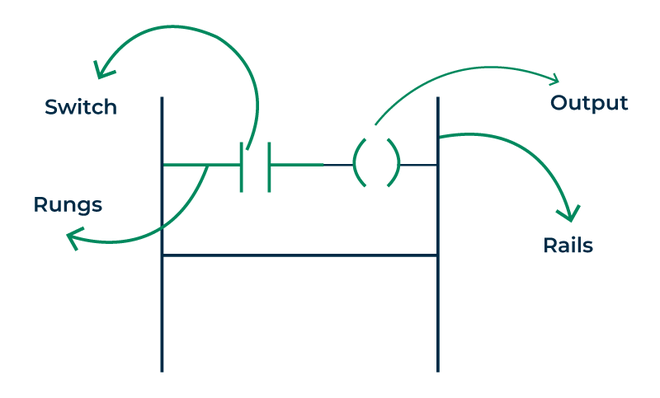
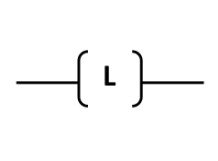
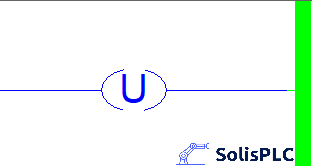

# Chapter 2: PLC Fundamentals

This chapter introduces the **Programmable Logic Controller (PLC)** — the brain of industrial automation. PLCs are used to control machines and processes by reading inputs, processing them according to a program, and then generating outputs.

---

## What is a PLC?

A **Programmable Logic Controller (PLC)** is an industrial-grade digital computer designed to:
- Receive **input signals** (from sensors, switches, etc.)
- Process them based on programmed logic
- Generate **output signals** (to actuators, contactors, lights, motors, etc.)

PLCs are widely used because they:
- Can withstand **harsh industrial environments** (temperature, pressure, vibration)
- Are **reliable** for continuous 24/7 operation
- Offer **modular** and **scalable** configurations

### PLC Programming Languages

PLCs can be programmed using several standardized languages (IEC 61131-3 standard):

| Language | Description | Common Use |
|-----------|--------------|-------------|
| **Ladder Diagram (LD)** | Graphical logic diagram resembling electrical circuits | Most popular in industry |
| **Statement List (STL)** / **Structured Text (ST)** | Text-based programming language | Complex calculations and logic |
| **Function Block Diagram (FBD)** | Uses interconnected functional blocks | Process control and automation |

> **Ladder Logic** is the most commonly used PLC language, especially for beginners and maintenance engineers.

#### 1. Ladder Logic Fundamentals

**Ladder Logic** represents control logic visually using **contacts** and **coils**, resembling electrical relay diagrams.  
Each rung represents a logic operation executed **left to right** and **top to bottom**.

| Type | Description | Common Use | Symbol |
|-----------|--------------|-------------| ------------ |
| Rails | Represent the power supply lines on both sides of a ladder diagram. Current flows from the left rail (L) to the right rail (R) through the connected logic elements. | Defines the power flow and structure of the ladder logic program. | |
| Rungs | Each horizontal line of logic between the rails. A rung represents one logical operation or control instruction. | Each rung performs a specific control task such as starting a motor or lighting an indicator | |
| Normally Open (NO) Contact | Represents a **software contact** that behaves the same as its physical hardware input. It is **open** when the input signal is **OFF**, and **closed** when the signal is **ON** | Start buttons, limit switches, proximity sensors, or any input that should activate only when pressed or detected.||
| Normally Closed (NC) Contact | Represents the **inverse** of the hardware input signal. It is **closed** when the physical input is **OFF**, and **open** when the input is **ON** | Stop buttons, safety switches, or emergency interlocks that should break the circuit when activated. | |
| Output Coil | Represents a **software output** that drives a hardware device (lamp, motor, etc.). When all contacts in the rung are **TRUE (closed)**, the coil is **energized (ON)** | Motors, lamps, solenoids, or any actuator controlled by the PLC logic. | |
| Latch (Set Coil) | Keeps an output energized even after the activating condition is removed until an unlatch instruction resets it. | Used for maintaining a motor, alarm, or light in the ON state until explicitly turned off. | |
| Unlatch (Reset Coil) | De-energizes a latched output, returning it to its normal state. Works in combination with a latch instruction | Used to turn OFF motors, alarms, or processes that were latched ON. | |

##### Types of Ladder Elements

###### Hardware-Related Elements
These represent **real-world input and output devices**.

| Category | Examples | Description |
|-----------|-----------|-------------|
| **Inputs** | Start switch, Stop switch, Limit sensor | Software contacts mirror the real physical input state |
| **Outputs** | Contactors, Lamps, Motors | Driven by coils or relay outputs in ladder logic |

###### Software-Related Elements
These exist **only in the program** and have **no physical connection** to real devices.  
They are used for internal logic and memory storage.

| Symbol | Type | Description |
|---------|------|-------------|
| [ NO ] | Normally Open | Software-only logical contact |
| [ NC ] | Normally Closed | Inverse logic software contact |
| ( Coil ) | Output Coil | Internal flag or logical output |

--- 

> **In short:**  
> Ladder logic simplifies automation design by visually mapping **electrical control logic** into a programmable format.  
> It forms the foundation for designing, troubleshooting, and expanding PLC-based control systems.

---
