# Chapter 3: LogixPro Basic

This chapter covers **fundamental PLC ladder logic concepts** using the **LogixPro simulator**, following along with the video tutorial.

### [🎥 Watch here](https://www.youtube.com/watch?v=gMZKQE3zW7c&t=1s)

You’ll learn how to simulate toggle switches, basic logic operations, and motor start/stop control using ladder logic.

---
## Toggle Switches
The following examples demonstrate how toggle switches and basic logic functions behave in ladder logic.  Each section includes the **ladder diagram**, **I/O simulator output**, and a short description of the logic.

| Ladder Code | I/O Simulator | Description |
|-----------|--------------|-------------|
|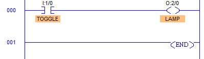|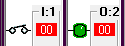|**Single Toggle Control:** A single toggle switch controls the lamp. When pressed, the output (lamp) turns ON; pressing again turns it OFF.|
|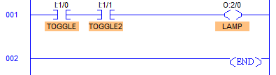|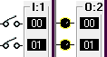!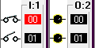 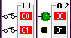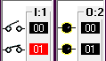|**AND Logic (Series Contacts):** The lamp turns ON only when both toggle switches are ON simultaneously — demonstrating logical AND behavior. |
|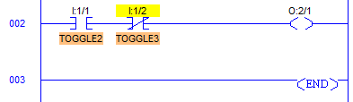|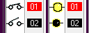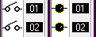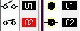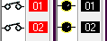| **OR Logic (Parallel Contacts):** The lamp turns ON when either toggle switch is ON — demonstrating logical OR behavior.|

## PLC motor start stop ladder code
This section simulates a **Start/Stop control circuit** using momentary push buttons — one for starting the motor and one for stopping it.

| Ladder Code | I/O Simulator | Description |
|-----------|--------------|-------------|
|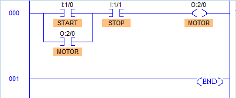|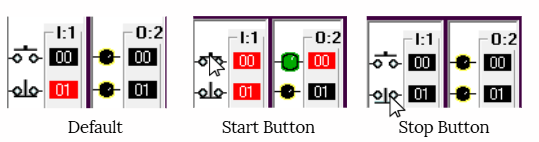| When the **Start (NO)** button is pressed, the motor coil energizes. The circuit is designed with a **seal-in (holding) contact**, which keeps the motor energized even after the button is released. Pressing the **Stop (NC)** button breaks the circuit and de-energizes the motor. |
|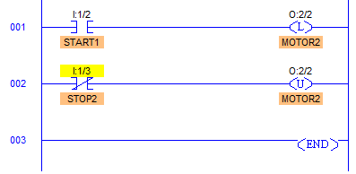|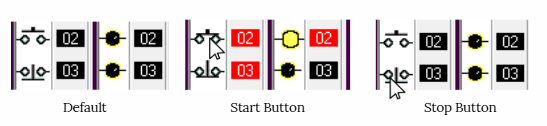|In this version, the standard output coil is replaced with a **latching output coil (Set/Reset)**. Once the Start button is pressed, the motor remains energized until the **Stop (NC)** button is pressed, which triggers the **unlatch (Reset)** function to de-energize the motor.|

## PLC motor two starts and two stops
Demonstrates redundancy and control flexibility by adding multiple start and stop inputs in parallel and series.

| Ladder Code | I/O Simulator | Description |
|-----------|--------------|-------------|
|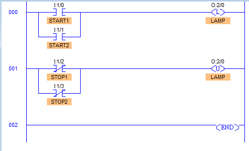|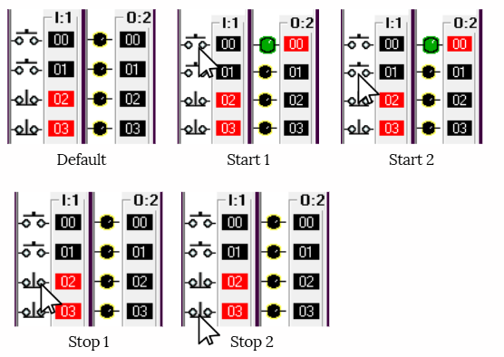|**Two Starts, Two Stops:** Two start buttons in parallel and two stop buttons in series. Either start button can activate the motor, but both stop buttons must be released for it to run.|
---

## Summary

| Concept | Description |
|----------|--------------|
| **Toggle Switch** | Used for manual ON/OFF control of an output. |
| **AND Logic** | Output activates when all inputs are ON. |
| **OR Logic** | Output activates when any input is ON. |
| **Start/Stop Circuit** | Common motor control logic using NO (Start) and NC (Stop) push buttons. |
| **Two-Start/Two-Stop** | Redundant circuit for safer and flexible operation. |

---

> 💡 **Tip:**  
> When building ladder logic in LogixPro, always verify I/O addressing and simulate your circuit step-by-step.  
> Observe the I/O indicators to confirm each rung behaves as expected before uploading to a real PLC.

---

