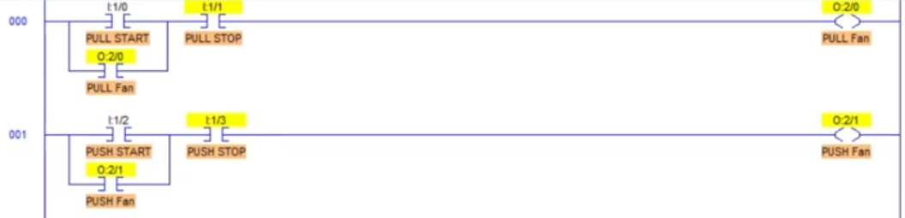

# Chapter 5: Industrial Fans Interlocking
This chapter covers **Industrial Fans Interlocking PLC ladder logic** using the **LogixPro simulator**, following along with the video tutorial.

### [🎥 Watch here](https://www.youtube.com/watch?v=Tu8-aFUGc9Q)

In this exercise, you’ll design a control system for **two industrial fans** that **cannot operate simultaneously**.  
Each fan has its own **Start** and **Stop** push buttons. The program ensures that one fan must be **turned OFF before** the other can be started — preventing hardware damage or overload.

---
## Parameters 
| I/O Simulator | Description |
|--------------|-------------|
|| Start and stop switches for **Pull fan**|
|| Start and stop switches for **Push fan**|
|| Indicator lamps for **Pull fan** and **Push fan** respectively|

## Two Fans working independently
This logic demonstrates basic operation where each fan can be started and stopped using its own buttons — **without interlocking**.

| Ladder Code | I/O Simulator | Description |
|-----------|--------------|-------------|
||| When the **Start 1 (NO)** button is pressed, the **Pull Fan** coil energizes. Pressing the **Stop 1 (NC)** button breaks the circuit and turns the fan OFF. |
|| | When the **Start 2 (NO)** button is pressed, the **Push Fan** coil energizes. Pressing the **Stop 2 (NC)** button de-energizes the fan. |
|||Both fans can run **at the same time** in this setup. This illustrates the limitation that will be addressed with the **interlocking feature**. |

## Interlocking Feature 
In this improved logic, **only one fan can run at a time**.  
If one fan is running, the other fan’s Start button will not energize its output coil until the first fan is stopped.

| Ladder Code | I/O Simulator | Description |
|-----------|--------------|-------------|
|||When the **Pull Fan** is energized and the **Start 2** button is pressed, the **Push Fan** does **not** energize because the Pull Fan’s output is interlocked with its rung. The same logic applies in reverse — the Pull Fan cannot start while the Push Fan is running.|

> 💡 **Tip:**  
> Interlocking logic is common in **industrial ventilation**, **motor sequencing**, and **safety systems**.  
> Always verify interlocks in simulation before deploying to real hardware.
