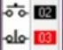

# Chapter 5: Industrial Fans Interlocking
This chapter covers **Industrial Fans Interlocking PLC ladder logic** using the **LogixPro simulator**, following along with the video tutorial.

### [🎥 Watch here](https://www.youtube.com/watch?v=Tu8-aFUGc9Q)

You’ll learn how to simulate two fans where two industrial fans **cannot** work at the same time to ensure that hardwares are not fried. These two fans have their own start and stop buttons. One fan should be turned off before turning on the other fan. 

---
## Parameters 
| I/O Simulator | Description |
|--------------|-------------|
|| Start switch and stop switch for pull fan|
|| Start switch and stop switch for push fan|
|| Pull fan and push fan indicator lights respectively|

## Two Fans working independently
| Ladder Code | I/O Simulator | Description |
|-----------|--------------|-------------|
||| When the **Start (NO)** button is pressed, the pull fan energizes. Pressing the **Stop (NC)** button breaks the circuit and de-energizes the fan.|
|| | When the **Start (NO)** button is pressed, the push fan energizes. Pressing the **Stop (NC)** button breaks the circuit and de-energizes the fan.|
|||The start and stop buttons for both the fans work independently. Both the fans operate at the same time (need to remove this)

## Interlocking Feature 
| Ladder Code | I/O Simulator | Description |
|-----------|--------------|-------------|
||