# Chapter 6: Industrial Fans One way Sequence
This chapter covers **Industrial Fans One way Sequence PLC ladder logic** using the **LogixPro simulator**, following along with the video tutorial.

### [🎥 Watch here](https://youtu.be/DE4wp5P1s9g)

In this exercise, you’ll design a control system for **three industrial fans** that operate in a **defined sequence**.  
Each fan has its own **Start** and **Stop** push buttons. The program ensures that a fan can only be **started or stopped** if the preceding fan(s) are already in the required state — helping to **prevent overloads and ensure proper ventilation sequencing**.

**Visual Representation**

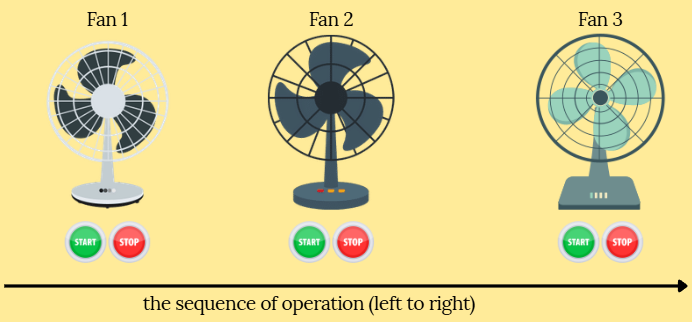

This diagram illustrates the **one-way sequence** of operation where:
> Fan 1 → Fan 2 → Fan 3

Each fan’s operation depends on the status of the fan before it.

---
## Parameters 
| I/O Simulator | Description |
|--------------|-------------|
|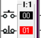| Start and stop switches for **Fan 1**|
|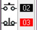| Start and stop switches for **Fan 2**|
|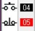| Start and stop switches for **Fan 3**|
|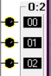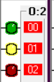| Indicator lamps for **Fan1, Fan2, Fan3** respectively|

## Three Fans working independently
This initial logic demonstrates each fan operating individually without sequence dependency.  
Each fan can start and stop at any time using its respective buttons.

| Ladder Code | I/O Simulator | Description |
|-----------|--------------|-------------|
|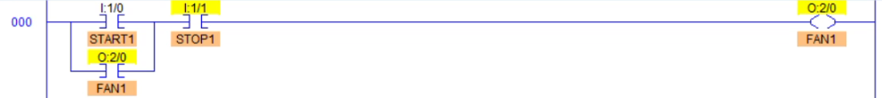|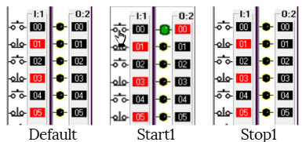| When the **Start 1 (NO)** button is pressed, the **Fan1** coil energizes. Pressing the **Stop 1 (NC)** button breaks the circuit and turns the fan OFF. |
|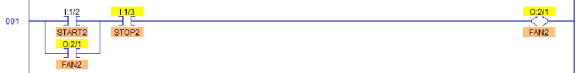|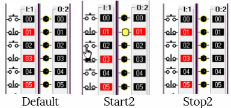| When the **Start 2 (NO)** button is pressed, the **Fan2** coil energizes. Pressing the **Stop 2 (NC)** button de-energizes the fan. |
|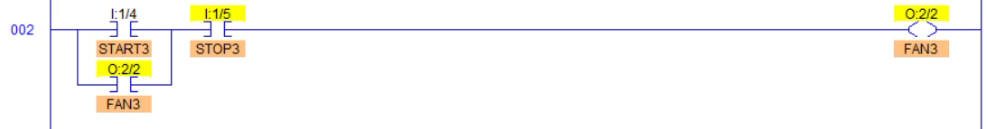|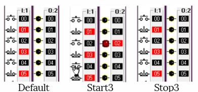| When the **Start 1 (NO)** button is pressed, the **Fan3** coil energizes. Pressing the **Stop 1 (NC)** button breaks the circuit and turns the fan OFF. |
|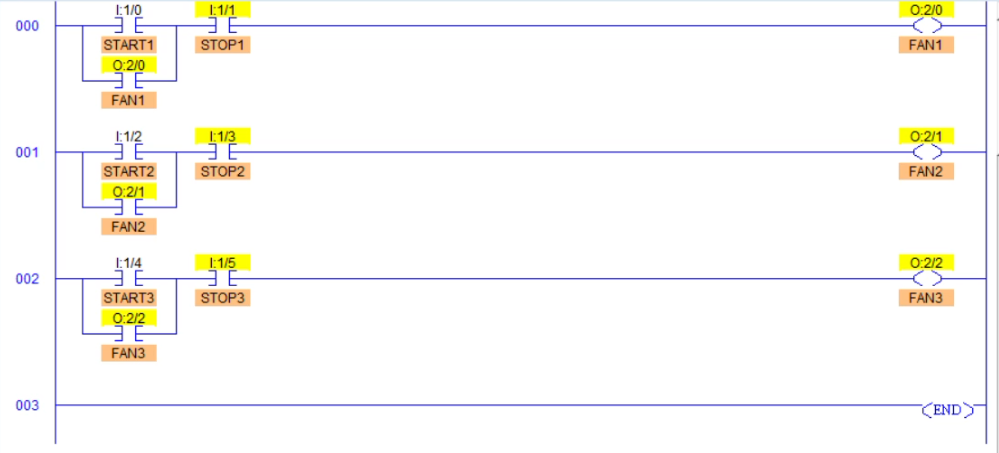|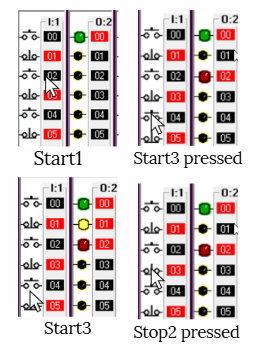|All three fans can run **in any order** in this setup. This setup highlights the limitation — there’s no sequencing or dependency between fans. |

## One way Sequence Feature 
In this improved logic, **fans operate in a strict sequence**.  
Each fan depends on the state of the previous fan — meaning a fan can only start if all prior fans are already running.  
Likewise, a fan can only stop if all succeeding fans are already stopped.

| Ladder Code | I/O Simulator | Description |
|-----------|--------------|-------------|
|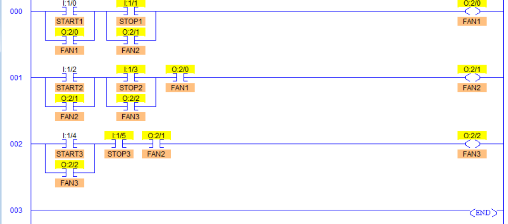|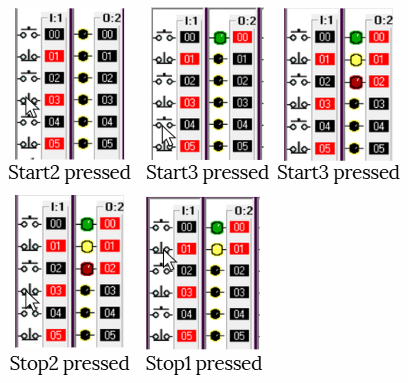| When **Fan 1** is ON, **Fan 2** can be started. When **Fan 1** and **Fan 2** are ON, **Fan 3** can be started. **Fan 1** cannot be turned OFF until and unless **Fan 2** and **Fan 3** are OFF — enforcing a one-way sequence from Fan 1 → Fan 2 → Fan 3. |

> 💡 **Tip:**  
>  One-way sequencing logic is often used in **industrial ventilation**, **cooling towers**, or **multi-stage motor control systems**.  
> It ensures balanced power usage and prevents reverse airflow or system overloads.

