# Chapter 7: door Automation System

This chapter demonstrates the **Door Automation Simulator** using the **LogixPro PLC simulator**, following the Section 7 video tutorial.

### [🎥 Watch here](insert link)

In this exercise, you’ll design an **automated garage door system** that can open, close, and stop using PLC ladder logic.  
You’ll also integrate **limit switches** and **motor control interlocking** to ensure safe operation.

**Visual Representation**

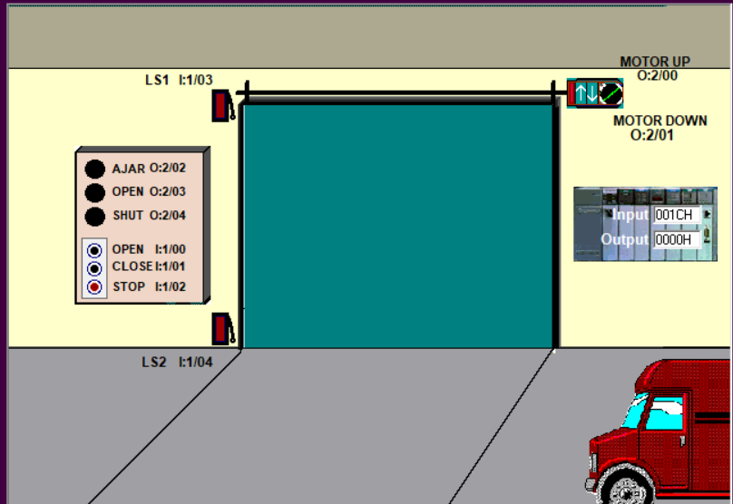

This diagram illustrates the **garage door setup** we’ll be simulating in this exercise — including control buttons, limit switches, and motor directions.

---
## Parameters 

| I/O | Description |
|------|-------------|
| 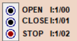 | **Digital Inputs:** The **Open** and **Close** buttons are *Normally Open (NO)* push buttons that control the door’s motion. The **Stop** button is *Normally Closed (NC)* — when pressed, it opens the circuit, cutting power and halting the door’s movement immediately (whether opening or closing). |
| 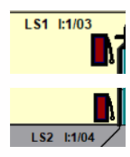 | **Digital Inputs (Limit Switches):** Mechanical switches that activate when pressed. **LS2 (Down Limit)** turns ON when the door is fully closed, while **LS1 (Up Limit)** turns ON when the door is fully open. These are used to detect and stop motion when the door reaches its end positions. |
|  | **Digital Outputs (Motor Control):** Two contactors control motor direction. When **Motor Up** is energized, the door opens (motor runs forward). When **Motor Down** is energized, the door closes (motor runs in reverse). Both contactors **must never** be active simultaneously — doing so would cause a short circuit. |
|  | **Digital Outputs (Indicators):** Lamps indicate door status — *Open*, *Closed*, or *Moving*. These provide visual feedback for the door’s operation. |

--- 

## Open and Close the Door

This initial ladder logic allows the door to **open and close** using the respective push buttons using the limit switches. The **Stop** button interrupts motion at any time. 

| Ladder Code | I/O Simulator | Description |
|-----------|--------------|-------------|
|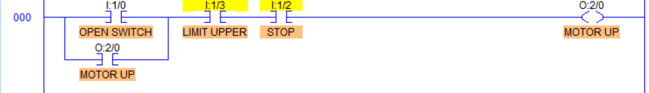|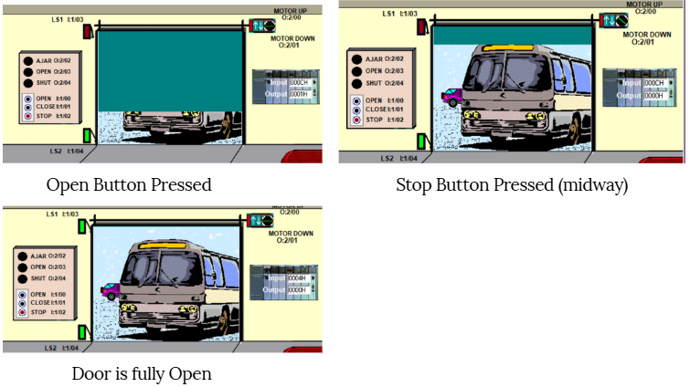| When the **OPEN (NO)** button is pressed, the **Motor Up** coil energizes, driving the door upward. Pressing the **STOP (NC)** button breaks the circuit and halts the motor. |
||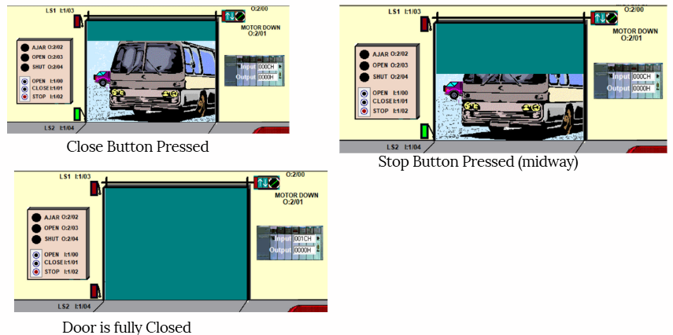| When the **CLOSE (NO)** button is pressed, the **Motor Down** coil energizes, driving the door downward. Pressing the **STOP (NC)** button breaks the circuit and halts the motor. |

## Interlocking Feature

This feature allows the motor to **not** work at the same time - preventing short circuits. 

|Status | Ladder Code | I/O Simulator | Description |
|----- | ------|--------------|-------------|
|**Before Interlocking**|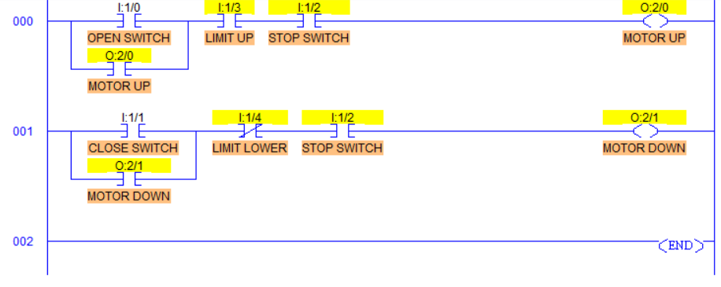|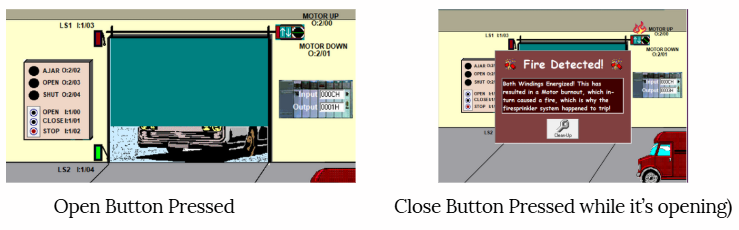| When the **OPEN (NO)** button is pressed, the **Motor Up** coil energizes, driving the door upward. However, pressing the **CLOSE (NO)** button while the motor is running can cause a **short circuit** since both contactors may be energized simultaneously. |
|**After Interlocking**| 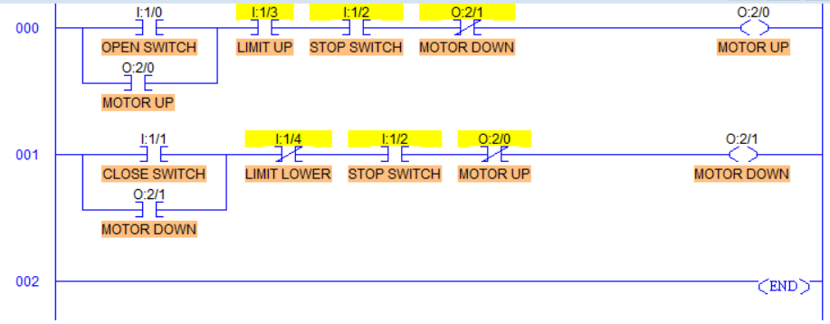|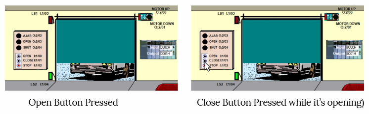| With interlocking logic applied, pressing the **CLOSE (NO)** button while the door is opening has **no effect**. This protects the circuit by ensuring that only one direction (Up or Down) can be active at a time.|

## Indicator Lights
Indicator lamps provide **visual feedback** on the current state of the door — whether it’s open, closed, or in motion.

| Status | Ladder Code | I/O Simulator | Description |
|---------|--------------|---------------|--------------|
| **Open** | 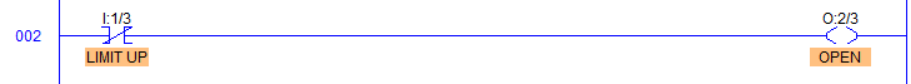 | 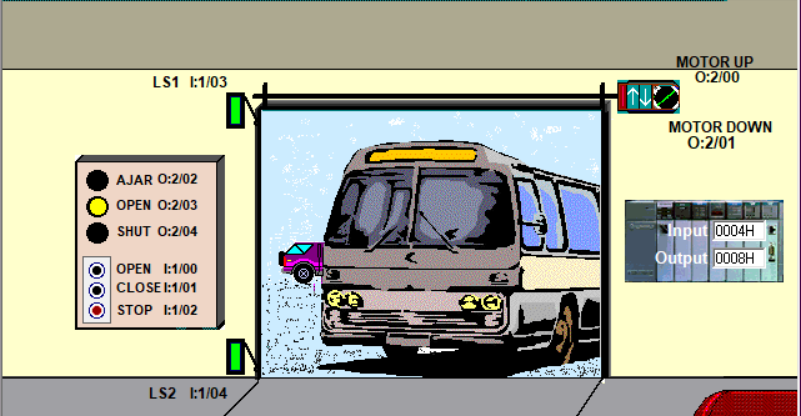| When the door is **fully open**, the **Upper Limit Switch (LS1)** activates. This opens the normally closed contact and turns ON the **“Open” indicator lamp**, signaling that the door is completely open. |
| **SHUT** | 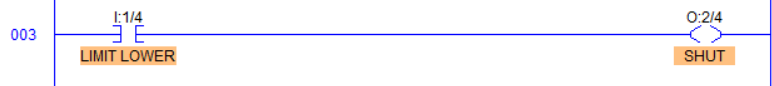| 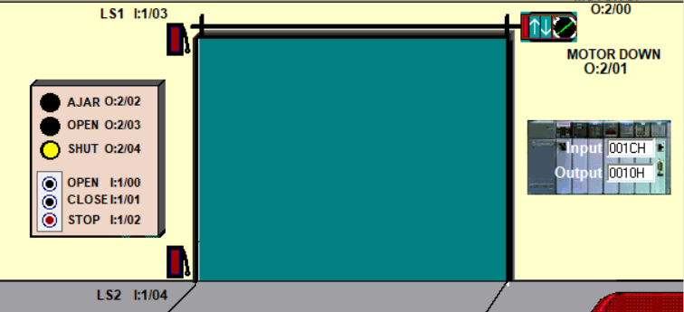 | When the door is **fully closed**, the **Lower Limit Switch (LS2)** activates. This closes the normally open contact and turns ON the **“Shut” indicator lamp**, signaling that the door is fully shut. |
| **Ajar / Moving** | 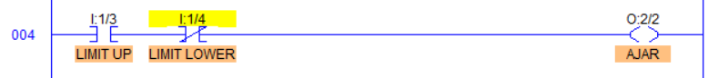| 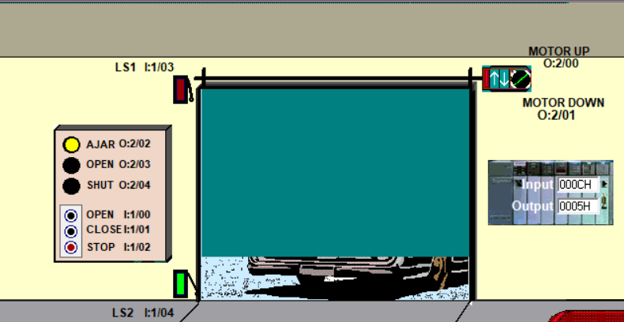 | If neither limit switch is active (the door is between open and closed), the **“Ajar”** lamp turns ON, indicating that the door is in motion or stopped midway. |

> 💡 **Tip:**  
> Interlocking and limit-switch-based feedback are core safety mechanisms in **industrial automation**, **elevators**, and **conveyor systems**.  
> They ensure reliable direction control and protect motors from overloading or electrical faults.