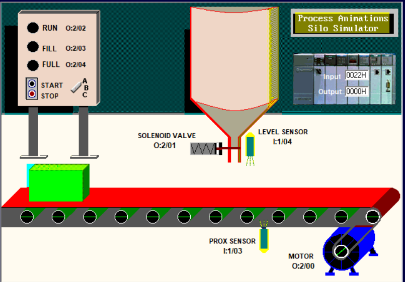
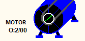
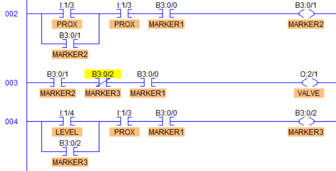
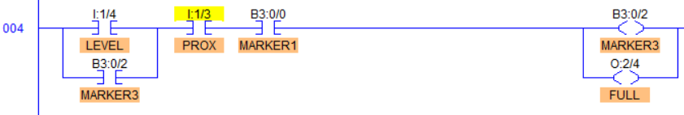

# Chapter 8: Silo Automation System

This chapter demonstrates the **Silo Automation Simulator** using the **LogixPro PLC simulator**, following the Section 8 video tutorial.

### [🎥 Watch here](https://youtu.be/qPa34WgEgNc)

In this exercise, you’ll design an **automated silo conveyor belt system** that uses a conveyor, sensors, and a solenoid valve to automatically **fill a box with liquid** using PLC ladder logic.  
The system incorporates **level sensors**, **proximity sensors**, and **solenoid valve** to ensure smooth and safe operation.

**Visual Representation**

This diagram illustrates the **silo automation setup** — including the conveyor, control buttons, sensors, and output devices (motor and solenoid valve).

---
## Parameters 

| I/O | Description |
|------|-------------|
| | **Digital Inputs (Start/Stop):** The **Start** button is a *Normally Open (NO)* push button used to activate the system. The **Stop** button is *Normally Closed (NC)* and halts the process immediately by opening the circuit — stopping both the conveyor and solenoid valve (if active). |
||**Digital Input (Proximity Sensor):** Detects when the box reaches the filling position under the tank. Outputs **LOW** when the box is away and **HIGH** when it’s correctly positioned. Used to stop the conveyor and trigger the filling sequence. |
|| **Digital Input (Level Sensor):** Detects when the liquid in the box has reached the **maximum level**. Produces a **HIGH** signal when full, which closes the valve and resumes the conveyor.|
|| **Digital Output (Motor):** Drives the conveyor belt. Energized when the system is running and de-energized when the proximity sensor trigger. |
|| **Digital Output (Solenoid Valve):** Controls the liquid flow from the tank into the box. Energized when the box is in position and turns OFF when the level sensor detects a full box. | 
|  |**Digital Outputs (Indicators):** Indicator lamps show system states: **Run**, **Fill**, and **Full**. The *Run lamp* indicates system operation, the *Fill lamp* shows when liquid is flowing, and the *Full lamp* indicates a completely filled box. |

---

## Start and Stop the System

This initial ladder logic allows the system to start and stop using push buttons.  
We use a **MARKER1**, an internal memory bit to store system state, similar to a variable in programming.  
This allows us to control multiple outputs (like the motor and valve) based on one logical condition.

| Ladder Code | I/O Simulator | Description |
|-----------|--------------|-------------|
||| When the **START (NO)** button is pressed, **MARKER1** energizes, which powers the motor to start the conveyor. When the **STOP (NC)** button is pressed, **MARKER1** de-energizes, turning off both the motor and valve. |

## Start the filling process

This section introduces **sensors** to automate the filling sequence.  
When the box reaches the filling point, the conveyor stops and the solenoid valve opens. Once the box is full, the valve closes, and the conveyor restarts automatically.

| Ladder Code | I/O Simulator | Description |
|--------------|---------------|--------------|
| | | **Opening the Valve:** When the **Proximity Sensor** detects the box (logic HIGH), **MARKER2** energizes. This turns ON the **Solenoid Valve**, starting the filling process. |
|  |  | **Stopping the Conveyor:** When **MARKER2** is HIGH (box detected), the motor rung uses an inverse logic condition to turn the conveyor OFF, ensuring the box remains stationary during filling. |
|  | | **Closing the Valve:** When the **Level Sensor** detects that the box is full (logic HIGH), **MARKER3** energizes. The rung logic (inverting MARKER3) and MARKER2 de-energizes the solenoid valve, stopping the liquid flow. |
| | | **Resume Conveyor:** The rung logic using MARKER3 in parallel to MARKER1 and (invert of MARKER2) powers the motor, resuming the conveyor belt.|
| |  | **Resetting marker for a loop:** We use the proximity sensor to reset the marker to ensure it's ready for the next box to fill.|

## Fixing some Ladder Code Logic
In this section, we’ll address and correct a few **logic bugs** identified during simulation.  
These adjustments ensure that the **Stop** button halts all system activity (not just the conveyor), prevents motion during filling, and avoids unwanted valve activation.

| Bug | Expected Behavior | Ladder Code | I/O Simulator | Description |
|--------|----------------------|--------------|---------------|--------------|
| **Stop button only stops conveyor** | Pressing the **Stop** button should halt **both the conveyor and the filling process** || | When the **STOP (NC)** button is pressed, **MARKER1** turns **LOW**. This LOW signal is propagated to **MARKER2**, **VALVE** and **MARKER3**, which de-energize both the motor and solenoid valve, completely stopping the filling and motor operation. |
| **Conveyor moves while box is filling** | The **conveyor should remain stopped** while the box is being filled |  |  | Introduce a new marker, **MARKER4**, to control the conveyor motor instead of using **MARKER1** directly. **MARKER4** is disabled (set to LOW) when the **Proximity Sensor** output is HIGH — meaning the box is in position for filling. This ensures the conveyor does not move while the box is under the tank after pressing the **START** button. |
| **Valve opens momentarily when box leaves position once we press on START when the two sensors produce a logic HIGH** | The **valve should remain closed** when the box leaves the filling station || | Modify the logic so that the **Solenoid Valve** only activates when the **START** Button isn't pressed. This prevents brief false openings or “one-pulse†valve activations when the box is moving away from the sensor while both the sensors are **HIGH**. |

## Indicator Lights
Indicator lamps provide **visual feedback** on the current state of the system — whether it’s running, filling, or full.

| Status | Ladder Code | I/O Simulator | Description |
|---------|--------------|---------------|--------------|
| **Run** |  |  | When the **Motor** is energized, the **Run Lamp** turns ON in parallel with the motor. |
| **Fill** |  |  | When the **Solenoid Valve** is energized, the **Fill Lamp** turns ON, indicating that the system is currently filling a box. |
| **Full** |  |  | When **MARKER3** activates (box full), the **Full Lamp** turns ON, signaling completion of the fill cycle. |

> 💡 **Tip:**  
> Use **markers** to modularize logic and isolate functional states.  
> This is a common practice in **industrial automation**, **packaging**, and **process control systems** — ensuring reliability, safety, and maintainability.
