# Chapter 9: Timers
This chapter explains the concept and operation of **Timers** in PLC programming using the **LogixPro simulator**.

### [🎥 Watch here](https://www.youtube.com/watch?v=8JcoSNhdsI4)

Timers are control elements that **delay actions** for a set period after receiving an input signal.  
Unlike relays — which respond **instantaneously**, timers **wait** for a specified time interval before activating or deactivating outputs.

Timers are commonly used in automation to control **sequence delays**, **machine startup/shutdown timing**, **pulsing**, and **safety interlocks**.

---
## Types of Timers

### 1. **ON-Delay Timer (TON)**

The **ON-Delay Timer** delays the output signal for a preset duration **after the input turns ON**.  
If the input remains ON longer than the set time, the timer output activates.

#### Behavior:
- When the **input signal = 0**, the **output = 0**.  
- When the **input signal = 1** for **less than** the set delay time, the **output remains 0**.  
- When the **input signal = 1** for **longer than** the delay time, the **output becomes 1** — meaning the **Normally Open (NO)** contact closes, and the **Normally Closed (NC)** contact opens.  
- When the **input returns to 0**, the **output resets to 0**.

> 🧠 **Note:**  
> The ON-Delay Timer activates **after** the input remains ON for the set delay time.

#### Visualization:

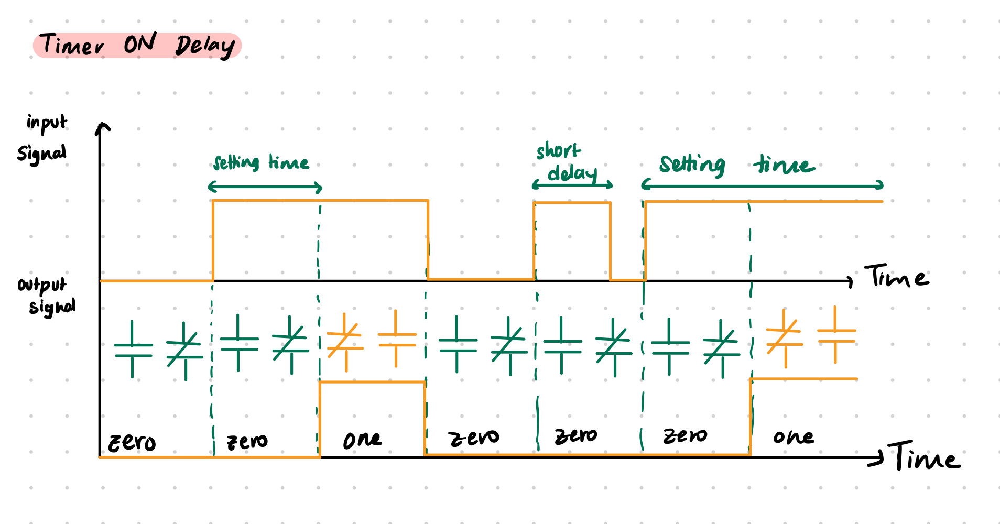

### 2. **OFF-Delay Timer (TOF)**

The **OFF-Delay Timer** delays turning the output **OFF** for a preset duration **after the input turns OFF**.  
In other words, the output remains ON for the set delay time once the input signal goes to 0.

#### Behavior:
- When the **input = 0**, the **output = 0**.  
- When the **input = 1**, the **output = 1** immediately (no delay).  
- When the **input = 0**, the **output remains 1** for the delay period, then turns OFF after the set time expires.

#### Visualization:
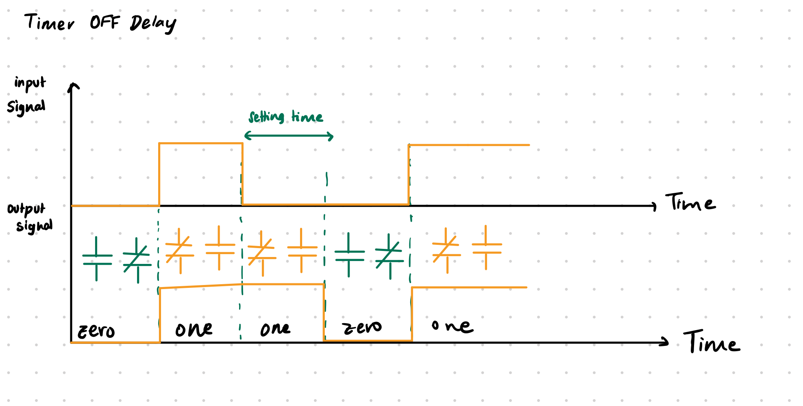

### 3. **Retentive ON-Delay Timer (RTO)**

The **Retentive Timer** (memory timer) accumulates total ON time across multiple input cycles.  
It “remembers” elapsed time even if the input signal turns OFF — until it is manually reset.

#### Behavior:
- The timer **adds up all previous ON durations**.  
- If the **accumulated ON time < preset time**, the **output = 0**.  
- When the **accumulated ON time ≥ preset time**, the **output = 1** — the **NO** contact closes and the **NC** contact opens.  
- Once the **output = 1**, it remains ON until the timer is **reset**.  
- Resetting the timer clears the accumulated time.

#### Example:
If the preset time is **30 minutes**:
- The timer is ON for 5 min → OFF → ON for 3 min → OFF → ON for 10 min  
  Total accumulated time = **18 min**, so output remains **OFF**.  
- If it later runs ON for another 15 min (total 33 min), output turns **ON** and stays ON until reset.

> **Note:**  
> Retentive timers are useful in applications where **elapsed time must be preserved** through power loss or process interruptions (e.g., batch processing or warm-up timers).

## Summary

| Timer Type | Abbreviation | Description | Key Behavior |
|-------------|--------------|--------------|---------------|
| **ON-Delay Timer** | TON | Delays output activation after input turns ON. | Output turns ON *after* preset time elapses. |
| **OFF-Delay Timer** | TOF | Delays output deactivation after input turns OFF. | Output remains ON *for* preset time after input turns OFF. |
| **Retentive ON-Delay Timer** | RTO | Accumulates ON time across cycles until reset. | Output turns ON once total ON time ≥ preset time. |

---

> 💡 **Tip:**  
> Timers are foundational for **sequential logic control** — such as conveyor delays, machine startup timing, and coordinated motion.  
> Always ensure timers are properly reset when designing repeating or looping automation logic.

---

##  PLC Delay Timer in LogixPro

### TON (Timer ON-Delay)

In this section, we’ll use the **TON (Timer ON-Delay)** instruction in **LogixPro** to introduce a delay before an output turns ON.

### Timer Components in LogixPro

Here’s what the **TON** timer block looks like in the LogixPro simulator:

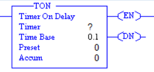

### Parameters

#### **Inputs**
- **Timer:** The address assigned to the timer. You can use any address between **T4:1 – T4:99**.  
  *Example:* `T4:1`
- **Time Base:** The factor used to calculate total delay time.  
  *Example:* `0.1` (each time unit equals 0.1 seconds)
- **Preset Value:** The set time duration before the output activates.  
  *Example:* `100` → Delay = `100 × 0.1 = 10 seconds`
- **Accumulated Value (Accum):** Displays the current elapsed time while the timer is counting.

#### **Outputs**
- **EN (Enable Bit):** Turns ON whenever the timer input is energized (logic HIGH).  
- **DN (Done Bit):** Turns ON after the accumulated time equals the preset time ➔ signaling that the timer has completed its delay.

---

### Mini Example – Lamp Delay Project

**Goal:** Energize a lamp **10 seconds after** pressing a toggle switch.

| Ladder Code | I/O Simulator | Description |
|--------------|---------------|--------------|
| 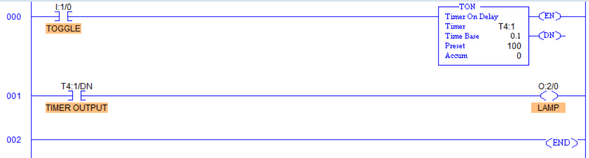| 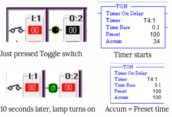 | When the **Toggle Switch** is pressed, the **TON timer (T4:1)** starts counting. Once the **Accumulated Value (Accum)** reaches the **Preset Value** of 10 seconds, the **Done (DN)** bit turns ON and energizes the **Lamp**. If the toggle switch is turned OFF before the timer completes, the timer resets and the lamp remains OFF. |

> 🧠 **Key Concept:**  
> The **TON** instruction is commonly used for delayed starts — for example, motor sequencing, staged activation, or warning lights that need to turn ON after a fixed delay.

---

### TOF (Timer OFF-Delay)

In this section, we’ll use the **TOF (Timer OFF-Delay)** instruction in **LogixPro** to introduce a delay before an output turns OFF.

### Timer Components in LogixPro

Here’s what the **TOF** timer block looks like in the LogixPro simulator:

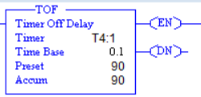

### Parameters

#### **Inputs**
- **Timer:** The address assigned to the timer. You can use any address between **T4:1 – T4:99**.  
  *Example:* `T4:1`
- **Time Base:** The factor used to calculate the total delay time.  
  *Example:* `0.1` → each time unit equals 0.1 seconds.
- **Preset Value (PRE):** The set time duration before the output turns OFF.  
  *Example:* `90` → Delay = `90 × 0.1 = 9 seconds`
- **Accumulated Value (ACC):** Displays the elapsed time while the timer is counting.

#### **Outputs**
- **EN (Enable Bit):** Turns ON whenever the timer input is energized (logic HIGH).  
- **DN (Done Bit):** Turns ON as long as the timer input is HIGH. When the input goes LOW, the **DN bit stays ON** until the timer finishes its OFF-delay count.

---

### Mini Example – Lamp Delay OFF Project

**Goal:** Keep a lamp energized for **9 seconds after** turning OFF a toggle switch.

| Ladder Code | I/O Simulator | Description |
|--------------|---------------|--------------|
| 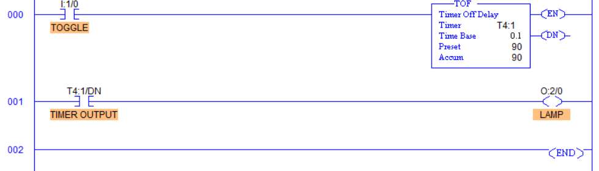| 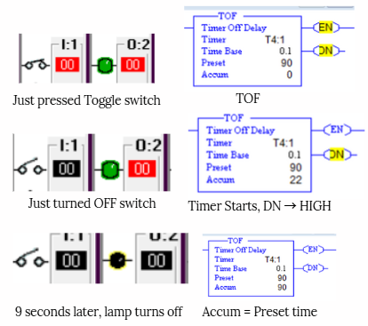 | When the **Toggle Switch** is ON, the lamp is energized immediately. When the toggle switch is turned OFF, the **TOF timer (T4:1)** begins counting. The lamp remains ON during this delay period. Once the **Accumulated Value (ACC)** reaches the **Preset Value (PRE)** of 9 seconds, the **Done (DN)** bit resets and the lamp turns OFF. |

> 🧠 **Key Concept:**  
> The **TOF** instruction is ideal for applications where you want an output to **remain active for a set duration after the input signal turns OFF**, such as **cooling fans**, **exhaust systems**, or **post-process timers**.

---

###  RTO (Retentive Timer ON)

In this section, we’ll use the **RTO (Retentive Timer ON)** instruction in **LogixPro** to demonstrate how a timer can **retain its accumulated time** even after the input signal turns OFF.  
Unlike the **TON** or **TOF** timers, the **RTO** does not automatically reset — it continues counting from where it left off until explicitly reset.

### Timer Components in LogixPro

Here’s what the **RTO** timer block looks like in the LogixPro simulator:

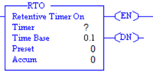

### Parameters

#### **Inputs** 
- **Timer:** The address assigned to the timer. You can use any address between **T4:1 – T4:99**.  
  *Example:* `T4:1`
- **Time Base:** The factor used to calculate the total delay time.  
  *Example:* `0.1` → each time unit equals 0.1 seconds.
- **Preset Value (PRE):** The set time duration before the output turns OFF.  
  *Example:* `100` → Delay = `100 × 0.1 = 10 seconds`
- **Accumulated Value (ACC):** Displays the total time accumulated — and **retains this value** even when the input goes LOW.

#### **Outputs**
- **EN (Enable Bit):** Turns ON whenever the timer input is energized (logic HIGH).  
- **DN (Done Bit):** Turns ON when the accumulated value equals the preset value — even if the input later turns OFF.  
- **RES (Reset):** A separate instruction is required to reset the timer and clear the accumulated time.

---

### Mini Example – Retentive Lamp Delay Project

**Goal:** Keep a lamp OFF until the timer has accumulated **10 seconds** of ON time — even across multiple switch activations.

| Ladder Code | I/O Simulator | Description |
|--------------|---------------|--------------|
| 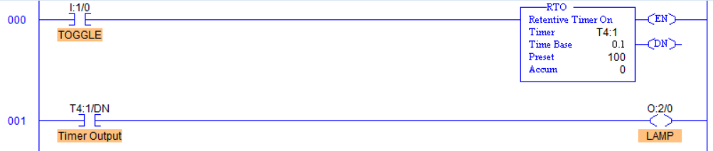 | 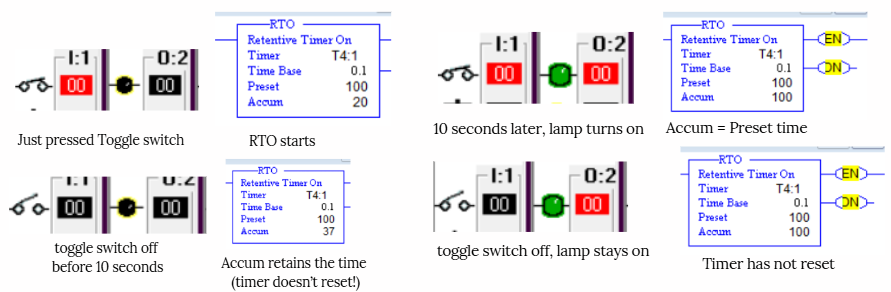 | When the **Toggle Switch** is ON, the timer starts counting. If the switch is turned OFF before the preset time is reached, the **RTO** retains (stores) the accumulated time. Each time the switch is turned back ON, the timer resumes counting from its last value. Once the accumulated time reaches the preset value, the **Done (DN)** bit energizes the lamp. Turning OFF the switch does **not** reset the lamp or timer. |
| 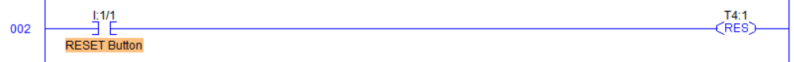 | 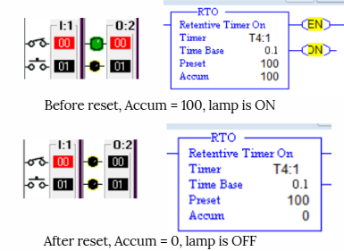 | To reset the timer and clear its accumulated value, use a **Reset (RES)** coil or push button. When pressed, it resets the **ACC** value to zero and turns OFF the lamp until the next cycle. |

---

> 🧠 **Key Concept:**  
> The **RTO** instruction is perfect for applications requiring **cumulative timing**, such as tracking **machine runtime**, **motor maintenance intervals**, or **multi-stage operations** where timing must persist even after interruptions.